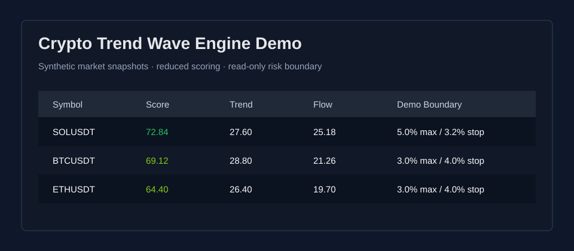

# Crypto Trend Wave Engine Demo


[中文说明](README.zh-CN.md)

Crypto Trend Wave Engine Demo is a public, sanitized, low-version demonstration
of a private crypto-market research workflow. It keeps only offline scoring,
synthetic samples, documentation, and testable boundaries that are safe to publish.

This demo does not connect to an exchange, does not place orders, and does not
contain private account data, API keys, live trading logs, or proprietary runtime data.



## What This Demo Shows

- Synthetic market snapshot loading.
- Reduced trend-wave factor scoring.
- Read-only risk boundary checks.
- Candidate ranking and Markdown report rendering.
- Internationalized documentation for public readers.

## Repository Map

| Path | Purpose |
| --- | --- |
| `src/trend_wave_demo/` | Offline demo scoring package |
| `data_samples/` | Synthetic CSV and JSON fixtures |
| `docs/` | Architecture, runbook, safety boundary, and demo data policy |
| `tests/` | Standard-library validation tests |

## Offline Usage

```powershell
$env:PYTHONPATH="src"
python -m trend_wave_demo.cli --sample data_samples/market_snapshot.csv
```

## Public Boundary

This repository is intended for portfolio review and technical communication.
It is not investment advice and it is not a production trading system.
