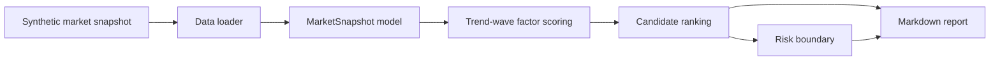

# Crypto Trend Wave Engine


[中文说明](README.zh-CN.md) · [Architecture](docs/architecture.md) · [Case Study](docs/case-study.md) · [Sanitization Policy](docs/sanitization-policy.md)

This repository is the public, sanitized release for the private `main`
branch of my crypto-market research system. The private project is larger; this
public edition keeps the publishable engineering shape: synthetic data loading,
reduced trend-wave scoring, explicit risk boundaries, Markdown reporting, tests,
CI, and documentation that explains the workflow without exposing private runtime
data.

This is not a trading bot release. It does not connect to an exchange, does not
place orders, and does not include account data, API keys, production thresholds,
private logs, or live execution routes.


## What This Release Shows

This release shows how I structure a research-heavy backend project when
the domain has noisy data, risk constraints, and audit requirements.

| Area | Public implementation | What it shows |
| --- | --- | --- |
| Data boundary | Synthetic CSV/JSON fixtures under `data_samples/` | I can separate public fixtures from private runtime data. |
| Domain model | Typed dataclasses for snapshots, scores, and risk boundaries | I keep business concepts explicit instead of passing raw dictionaries everywhere. |
| Scoring engine | Reduced trend, liquidity, flow, funding, and volatility factors | I can turn research assumptions into deterministic code. |
| Risk layer | Read-only position and stop-distance boundary output | I treat risk as a first-class product surface, not an afterthought. |
| Reporting | Markdown candidate report renderer | I make results reviewable by humans, not only consumable by scripts. |
| Quality gate | Standard-library unit tests and GitHub Actions workflow | I keep the public release verifiable without heavy dependencies. |

## Architecture Snapshot



My private system has more adapters and operational paths. In this public edition I kept
only the offline core so reviewers can see the project design without receiving
private strategy code or real account context.

## Offline Usage

```powershell
$env:PYTHONPATH="src"
python -m trend_wave_demo.cli --sample data_samples/market_snapshot.csv --limit 5
python -m unittest discover -s tests
```

Example output:

```text
# Candidate Report

| Symbol | Score | Trend | Flow | Risk Penalty | Public Boundary |
| --- | ---: | ---: | ---: | ---: | --- |
| BTCUSDT | 74.04 | 28.80 | 15.24 | 0.00 | 5.0% max / 3.2% stop |
| ETHUSDT | 69.21 | 26.40 | 13.56 | 0.00 | 3.0% max / 4.0% stop |
```

## Repository Map

| Path | Purpose |
| --- | --- |
| `src/trend_wave_demo/` | Offline scoring, ranking, risk, CLI, and report code |
| `data_samples/` | Synthetic market snapshots and scenario fixtures |
| `docs/` | Architecture, project walkthrough, case study, sanitization policy, and research notes |
| `tests/` | Unit tests and public fixtures |
| `.github/workflows/` | Lightweight CI validation |

## Why This Is A Public Release

I intentionally reduced the project before publishing it:

- I replaced private market caches with synthetic fixtures.
- I removed exchange credentials, account state, live routes, and production thresholds.
- I kept the architecture, naming, testing style, and documentation style visible.
- I wrote the commit history as a curated public history instead of exposing private runtime commits.

## Documentation

- [Architecture](docs/architecture.md)
- [Project walkthrough](docs/project-walkthrough.md)
- [Full-stack scope](docs/full-stack-scope.md)
- [Case study](docs/case-study.md)
- [Sanitization policy](docs/sanitization-policy.md)
- [Runbook](docs/runbook.md)
- [Release notes](RELEASE_NOTES.md)

## Public Boundary

I maintain this repository for portfolio review and technical communication. I
do not present it as investment advice, a production trading system, or a
promise of trading performance.
