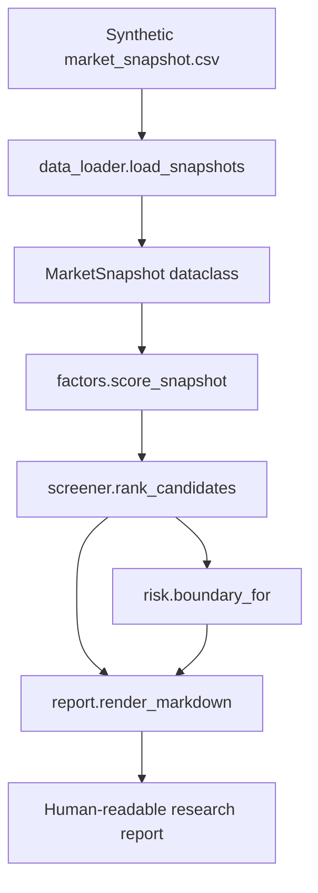

# Architecture

I designed this public demo as a small, inspectable slice of a larger private
research engine. The goal is to make the engineering boundary visible without
publishing private market caches, production thresholds, account state, or live
execution paths.

## System Flow

## Module Boundary

| Module | Responsibility | Why I kept it separate |
| --- | --- | --- |
| `models.py` | Domain objects for snapshots, scores, and boundaries | I want the scoring pipeline to speak in domain terms. |
| `data_loader.py` | CSV fixture loading | I keep IO at the edge so scoring stays deterministic. |
| `factors.py` | Reduced factor calculation | I can review assumptions and penalties independently. |
| `screener.py` | Candidate sorting and limit handling | Ranking is a workflow step, not a factor side effect. |
| `risk.py` | Read-only risk boundary output | Risk rules stay visible and testable. |
| `report.py` | Markdown rendering | Research output should be readable outside the codebase. |
| `cli.py` | Offline command entry point | I keep the demo easy to validate without services. |

## Design Notes

I intentionally avoided heavy dependencies in this demo. The private system uses
more adapters and runtime services, but the public version is easier to audit if
it can run with the Python standard library.

The scoring numbers are reduced examples. They are not production thresholds and
they are not copied from my private trading workflow.

## 中文摘要

我把公开 demo 设计成一个小而清晰的后端切片：数据读取在边缘，领域模型显式，
评分、排序、风控和报告分层。这样可以展示工程结构，又不会公开私有行情缓存、
生产阈值、账户状态或实盘执行路径。
